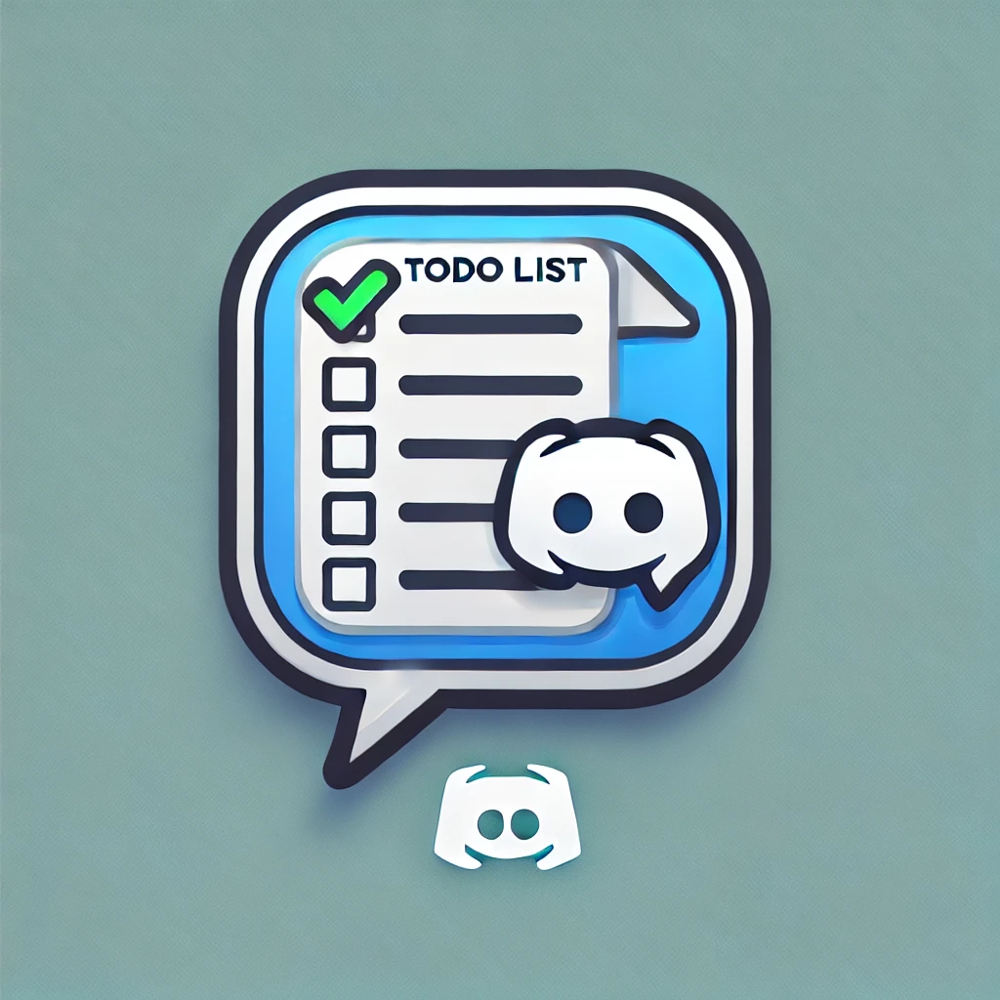

<div align="center">
	<br />
	<p>
		<a href="#"></a>
	</p>
	<br />
</div>

## About

This bot will help you keep track of your own tasks. Available in both DM, Group Message, and servers. All your task/s are synced anywhere you access them.

## Available Slash Commands

- [x] /addtask <task_name: string>
- [x] /listtask
- [x] /removetask <task_name: string>
- [ ] /setreminder <task_name: string> <reminder_date: Date>

Install the bot by clicking this [link](https://discord.com/oauth2/authorize?client_id=1295395840759828633)

## Want to clone and customize?

> Important Notes: Make sure you have already setup your own [discord-bot](https://discordjs.guide/preparations/setting-up-a-bot-application.html#creating-your-bot) and mongodb project.

### Private Credentials

You need to create a `.env` file in your root directory for the following:

```js
TOKEN=<your_bot_token>
APP_ID=<your_bot_app_ID>
PUBLIC_KEY=<your_bot_public_key>

# Mongo DB
MONGO_URI=<your_mongodb_connection_string>
```

### Usage

1. Clone this repo

```bash
npm install
```

2. Run the command deployment

```bash
npm run register
```

3. Start the bot

```bash
npm run dev
```

Once the bot is running, you should be able to perform the slash commands in servers, direct message (DM), or Group Message.

## Contributing

Pull requests are welcome. For major changes, please open an issue first
to discuss what you would like to change.

Please make sure to update tests as appropriate.
